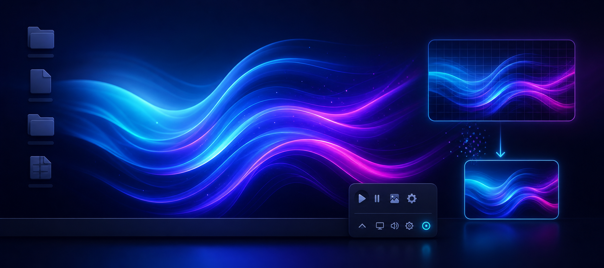
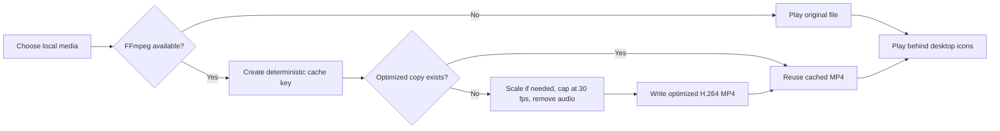

# Mini Wallpaper

<p align="center">
  
</p>

<p align="center">
  A focused, ultra-light animated wallpaper app for Windows.
</p>

<p align="center">
  <a href="https://github.com/Mirochill/mini-wallpaper/actions/workflows/ci.yml"></a>
  <a href="LICENSE"></a>
  <a href="#requirements"></a>
  <a href="#requirements"></a>
  <a href="#media-optimization"></a>
</p>

Mini Wallpaper is for people who like animated wallpapers but only need the
focused part: play a local video or GIF behind the desktop icons with as little
overhead as possible.

It deliberately avoids a browser runtime, a wallpaper store, and a heavy
management interface. Choose local media from the tray menu and let the app
prepare a lean playback copy automatically.

> [!NOTE]
> Mini Wallpaper is an independent project and is not affiliated with Lively
> Wallpaper.

## Highlights

| Capability | Mini Wallpaper approach |
| --- | --- |
| Runtime | Native WPF window embedded behind the desktop icons |
| Media source | Local files only |
| Controls | Compact notification-area menu |
| Optimization | Automatic FFmpeg transcoding before playback |
| Cache | Deterministic optimized copies reused across launches |
| Startup | Optional per-user Windows startup entry |
| Dependencies | No browser runtime and no package manager at runtime |

## Quick Start

### Download a release

Download `mini_wallpaper.exe` from the
[latest release](https://github.com/Mirochill/mini-wallpaper/releases/latest)
and place it in a folder of your choice.

For automatic media optimization, place `ffmpeg.exe` next to
`mini_wallpaper.exe`. Without FFmpeg, Mini Wallpaper can still play supported
files directly, but it skips the optimization step.

The published executable is not digitally signed, so Windows may display a
warning on first launch. The complete source and build scripts remain
available for auditing and local builds.

### Install for the current user

Clone the repository, ensure that `ffmpeg.exe` is available on `PATH`, then run:

```powershell
git clone https://github.com/Mirochill/mini-wallpaper.git
cd mini-wallpaper
powershell -ExecutionPolicy Bypass -File .\native-wpf\install.ps1
```

If FFmpeg is not on `PATH`, pass it explicitly:

```powershell
powershell -ExecutionPolicy Bypass -File .\native-wpf\install.ps1 -FfmpegPath "C:\path\to\ffmpeg.exe"
```

The installation script:

1. builds the native executable;
2. installs it into `%LOCALAPPDATA%\Programs\MiniWallpaper\`;
3. copies `ffmpeg.exe` next to the installed app;
4. enables launch at startup for the current user;
5. starts Mini Wallpaper in the background.

## Usage

Mini Wallpaper lives in the Windows notification area. Open its tray menu to:

| Action | Result |
| --- | --- |
| Choose a wallpaper | Select a local video or animated GIF |
| Pause or resume | Temporarily stop or restart playback |
| Launch at startup | Toggle the per-user Windows startup entry |
| Quit | Close the wallpaper window and tray icon |

On first launch, Mini Wallpaper checks for
`Documents\Gifs\wallpaper.mp4`. If it cannot find a saved or default wallpaper,
it opens the file picker.

## Supported Media

| Input format | Playback preparation |
| --- | --- |
| `.mp4` | Optimized MP4 playback copy when FFmpeg is available |
| `.wmv` | Optimized MP4 playback copy when FFmpeg is available |
| `.avi` | Optimized MP4 playback copy when FFmpeg is available |
| `.mov` | Optimized MP4 playback copy when FFmpeg is available |
| `.gif` | Converted to an optimized MP4 copy when FFmpeg is available |

If optimization cannot complete, Mini Wallpaper keeps the original file
usable instead of failing the wallpaper change.

## Media Optimization

Mini Wallpaper leaves the original file untouched and creates an optimized
playback copy in:

```text
%LOCALAPPDATA%\MiniWallpaper\optimized\
```

The import pipeline:

- converts supported media to H.264 MP4;
- converts animated GIFs to MP4;
- caps playback media at `30 fps`;
- scales media down only when it exceeds the primary monitor resolution;
- removes audio from the wallpaper copy;
- stores deterministic cached copies so the same file is not transcoded again
  needlessly.



This matters because animated GIFs and oversized `4K60` videos are expensive
formats for a desktop background.

### Example from a real desktop

On the machine this project was built on:

| Scenario | Before | After |
| --- | ---: | ---: |
| Wallpaper media | `4K60 MP4`, `27.04 MB` | `1080p30 MP4`, `4.69 MB` |
| Mini Wallpaper private memory while playing | `~640 MB` | `~210 MB` |

These are concrete local measurements, not a universal benchmark. They show
the kind of avoidable work the app is designed to remove.

## Local Files

| Path | Purpose |
| --- | --- |
| `%LOCALAPPDATA%\MiniWallpaper\wallpaper.txt` | Stores the active wallpaper path |
| `%LOCALAPPDATA%\MiniWallpaper\optimized\` | Stores cached playback copies |
| `%LOCALAPPDATA%\Programs\MiniWallpaper\` | Default installation directory |

Original wallpaper files are never modified.

## Build from Source

### Requirements

- Windows 10 or Windows 11.
- Windows PowerShell 5.1 or PowerShell 7.
- .NET Framework 4.x tooling already available on Windows.
- `ffmpeg.exe` for automatic media optimization during normal use.

### Build

```powershell
powershell -ExecutionPolicy Bypass -File .\native-wpf\build.ps1
.\dist-native\mini_wallpaper.exe
```

The build uses the .NET Framework compiler already installed with Windows and
does not require a NuGet restore.

## Design Scope

Mini Wallpaper intentionally stays narrow. It currently does **not** include:

- a wallpaper marketplace;
- web wallpapers;
- widgets;
- playlists;
- multi-monitor scene management;
- a large visual library manager.

If you need a full wallpaper ecosystem, Lively Wallpaper is a better fit. If
you only need a local animated wallpaper with very little baggage, Mini
Wallpaper is designed for that.

## Project Layout

```text
native-wpf/
  Program.cs      # application code
  build.ps1       # local build
  install.ps1     # install, copy FFmpeg, enable startup
```

The implementation remains compact enough for its complete behavior to fit in
one main source file.

## Roadmap

- Better multi-monitor handling.
- Optional cache management UI.
- Signed release builds.
- A friendlier first-run installer.

## Contributing

Focused improvements are welcome. Read [CONTRIBUTING.md](CONTRIBUTING.md)
before opening a pull request and follow the
[Code of Conduct](CODE_OF_CONDUCT.md).

Report vulnerabilities privately according to [SECURITY.md](SECURITY.md).

## License

Mini Wallpaper is open source under the [MIT License](LICENSE).
