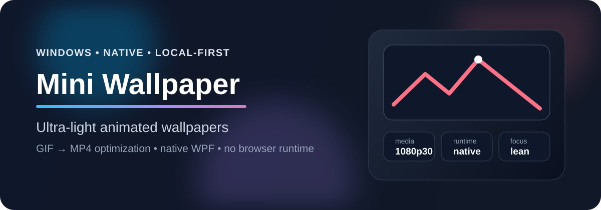

# Mini Wallpaper

**An ultra-light animated wallpaper app for Windows.**



Mini Wallpaper is for people who like the idea of Lively Wallpaper, but only need the focused part: play local animated wallpapers behind the desktop icons with as little overhead as possible.

It is intentionally small:

- native WPF app, no browser runtime;
- local media only, no wallpaper store or online catalog;
- tray menu instead of a heavy management UI;
- automatic media optimization before playback.

> Mini Wallpaper is an independent project and is not affiliated with Lively Wallpaper.

## Why it exists

Lively Wallpaper is powerful, but many users only want one thing: a local animated wallpaper that stays out of the way.

Mini Wallpaper trades breadth for efficiency. It does not try to be a full wallpaper platform. It tries to be the smallest pleasant tool that solves the core use case well.

## What makes it lightweight

When you choose a wallpaper, Mini Wallpaper keeps the original untouched and creates an optimized playback copy in:

```text
%LOCALAPPDATA%\MiniWallpaper\optimized\
```

The import pipeline:

- converts animated GIFs to MP4;
- caps playback media at 30 fps;
- scales videos down only when they exceed the primary monitor size;
- stores deterministic cached copies so the same file is not transcoded again needlessly.

This matters because animated GIFs and oversized 4K60 videos are expensive formats for a desktop background.

### Example from a real desktop

On the machine this project was built on:

| Scenario | Before | After |
| --- | ---: | ---: |
| Wallpaper media | 4K60 MP4, 27.04 MB | 1080p30 MP4, 4.69 MB |
| Mini Wallpaper private memory while playing | ~640 MB | ~210 MB |

Those numbers are a concrete local measurement, not a universal benchmark, but they show the kind of waste the app is designed to remove.

## Features

- MP4, WMV, AVI, MOV, and GIF input support
- Automatic GIF-to-MP4 optimization
- Native desktop embedding behind icons
- Tray menu for:
  - choosing a wallpaper
  - pausing or resuming playback
  - enabling launch at startup
  - quitting the app
- Automatic startup support
- Original wallpaper files are never modified

## Non-goals

Mini Wallpaper is deliberately narrow. It currently does **not** include:

- a wallpaper marketplace
- web wallpapers
- widgets
- playlists
- multi-monitor scene management
- a large visual library manager

If you need a full wallpaper ecosystem, Lively Wallpaper is the better fit. If you only want a local animated wallpaper with very little baggage, Mini Wallpaper is built for that.

## Requirements

- Windows
- .NET Framework tooling already available on Windows for local builds
- `ffmpeg.exe` available when running `native-wpf/install.ps1`
  - the installer copies `ffmpeg.exe` next to the installed app so automatic optimization keeps working afterward

## Quick start

### Build locally

```powershell
powershell -ExecutionPolicy Bypass -File .\native-wpf\build.ps1
.\dist-native\mini_wallpaper.exe
```

### Install for the current user

```powershell
powershell -ExecutionPolicy Bypass -File .\native-wpf\install.ps1
```

If `ffmpeg.exe` is not on `PATH`, pass it explicitly:

```powershell
powershell -ExecutionPolicy Bypass -File .\native-wpf\install.ps1 -FfmpegPath "C:\path\to\ffmpeg.exe"
```

The installer:

1. builds the native app;
2. installs it to `%LOCALAPPDATA%\Programs\MiniWallpaper\`;
3. copies `ffmpeg.exe` next to the executable;
4. enables launch at startup;
5. starts the installed app.

## How wallpaper selection works

1. On first launch, Mini Wallpaper looks for `Documents\Gifs\wallpaper.mp4`.
2. If no saved wallpaper exists, it opens a file picker.
3. When a media file is selected, it is optimized automatically.
4. The active wallpaper path is stored in:

```text
%LOCALAPPDATA%\MiniWallpaper\wallpaper.txt
```

## Project layout

```text
native-wpf/
  Program.cs      # application code
  build.ps1       # local build
  install.ps1     # install + ffmpeg copy
```

## Development

```powershell
powershell -ExecutionPolicy Bypass -File .\native-wpf\build.ps1
```

The project is intentionally compact so the full behavior can still be understood from one main source file.

## Roadmap ideas

- better multi-monitor handling
- optional cache management UI
- signed release builds
- a friendlier first-run installer

## License

Mini Wallpaper is open source under the [MIT License](LICENSE).
